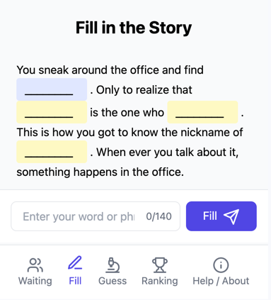
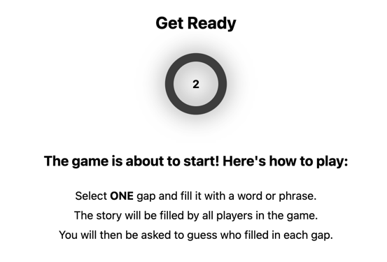

# Blank vs humanity (WordWeaver UI)

It's a game where you can challenge your friends to see who is the most creative and can you figure out who completed
the blank spaces of a sentence with the funny and creative answers.

| Fill in the blank            | Get ready                              |
|------------------------------|----------------------------------------|
|  |  |

## How to play

See [https://github.com/2er0/WordWeaver](https://github.com/2er0/WordWeaver)

## How to build

### Prerequisites

- [Git](https://git-scm.com/downloads)
- [Node.js](https://nodejs.org/en/download/)
- [npm](https://www.npmjs.com/get-npm)
- [WordWeaver Backend](https://github.com/2er0/WordWeaver)
- [Docker](https://docs.docker.com/get-docker/)
- [Docker Compose](https://docs.docker.com/compose/install/)

### Steps

1. Clone the repository and the backend repository
2. Start the backend server and the database with `docker-compose up`
3. Install dependencies with `npm install`
4. Run the project with `npm run dev`
5. Open [http://localhost:3000](http://localhost:3000) to view it in the browser
6. Enjoy!

### Build

- Run `npm run build` to build the project
- The build is minified and the filenames include the hashes
- Your app is ready to be deployed!
